<h1> Açıklama </h1>

<strong>Emu8086</strong> kullanılarak 8086 mimarisinde Türkçe ve İngilizce için sayıdan yazı   ve yazıdan sayı dönüşümü yapabilen, ayrıca yazı olarak verilmiş iki sayı üzerinde  toplama, ve çıkarma işlemlerinin yapılabildiği bir program assembly dilinde gerçeklenmektedir. 

 <h2 style="display: inline-block;">1 - Şekil1:</h2> Dil seçeneği sorgusu 

 <h2 style="display: inline-block;">2 - Şekil2:</h2> Dil girişi 

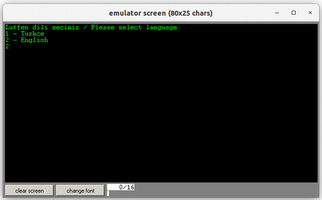

 <h2 style="display: inline-block;">3 - Şekil3:</h2> Yapılacak işlem menüsü 

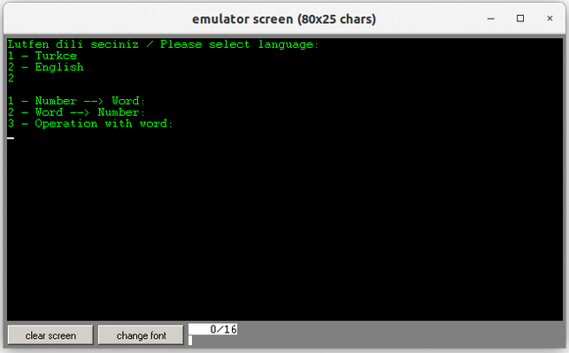

 <h2 style="display: inline-block;">4 - Şekil4:</h2> Yazıya çevrilmesi gereken nümerik değer sorgusu 

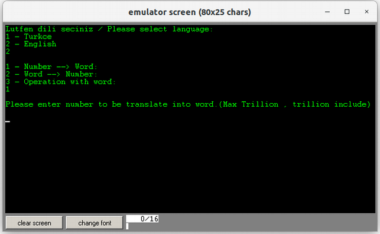

 <h2 style="display: inline-block;">5 - Şekil5:</h2>  Yazıya çevrilmesi gereken nümerik değer girişi 

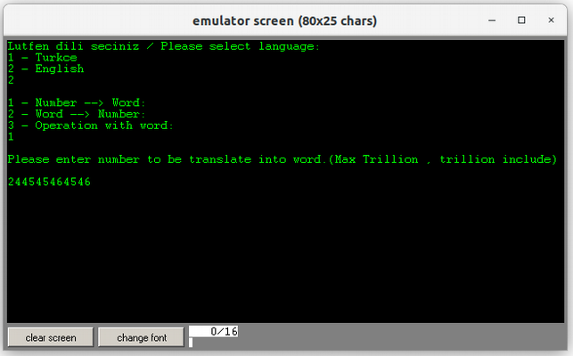

 <h2 style="display: inline-block;">6 - Şekil6:</h2> Yazıya çevrilmiş sayı cevabı 

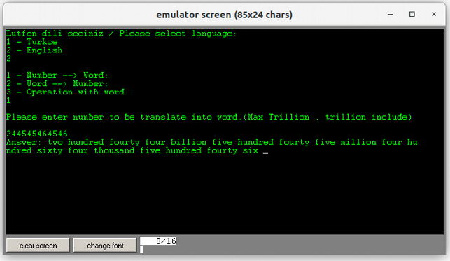

 <h2 style="display: inline-block;">7 - Şekil7:</h2> Sayıya çevrilmesi gereken yazı sorgusu 

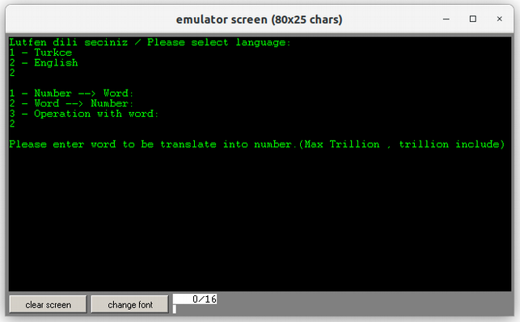

 <h2 style="display: inline-block;">8 - Şekil8:</h2> Sayıya çevrilmesi gereken nümerik değerin yazı karşılığı girişi 

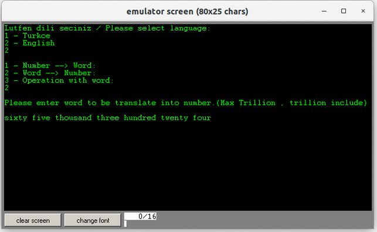

 <h2 style="display: inline-block;">9 - Şekil9:</h2> Sayıya çevrilmiş yazı cevabı 

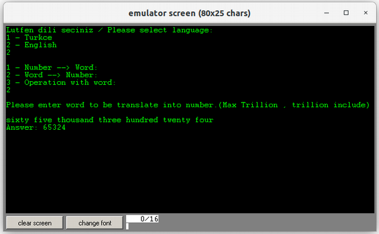

 <h2 style="display: inline-block;">10 - Şekil10:</h2> Yazı ile işlem menüsü 

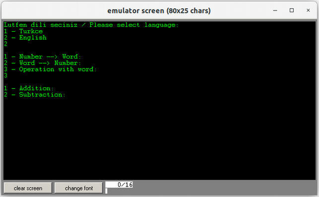

 <h2 style="display: inline-block;">11 - Şekil11:</h2> Operand1 sorgusu 

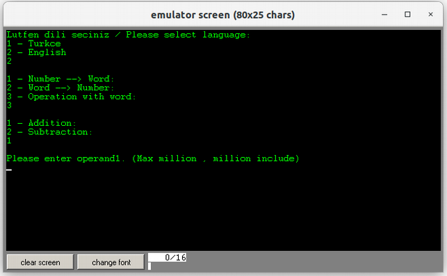

 <h2 style="display: inline-block;">12 - Şekil12:</h2> Operand1 girişi ve operand2 sorgusu 

 <h2 style="display: inline-block;">13 - Şekil13:</h2> Operand2 girişi ve sistemin cevabı (Toplama için) 

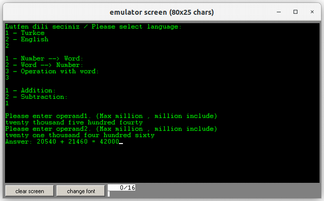

 <h2 style="display: inline-block;">14 - Şekil14:</h2> Operand2 girişi ve sistemin cevabı (Çıkarma için) 

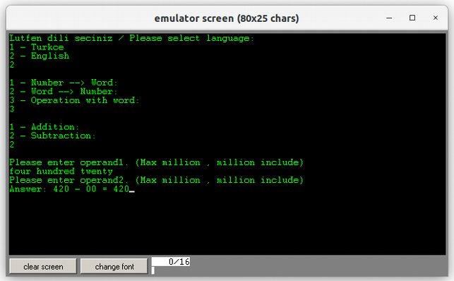

